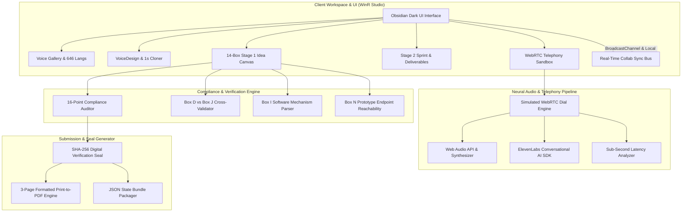

# 🎙️ WinR Studio - Open Source AI Voice Studio & Challenge Suite

> **WinR Studio** is a fully-local, zero-latency neural voice synthesis, voice cloning, and interactive challenge workspace engineered for the **Ignyte × ElevenLabs Hackathon**.

[](https://opensource.org/licenses/MIT)
[](https://elevenlabs.io)
[](#voice-gallery)
[](#automated-16-point-compliance-auditor)

---

## 🌐 Language / Bahasa
- [English Guide](#english-documentation)
- [Panduan Bahasa Indonesia](#panduan-bahasa-indonesia)

---

<a name="english-documentation"></a>
# 🇬🇧 English Documentation

## 📑 Table of Contents
1. [Overview & Highlights](#1-overview--highlights)
2. [System Architecture Diagram](#2-system-architecture-diagram)
3. [Step-by-Step Usage Tutorial](#3-step-by-step-usage-tutorial)
4. [Competition Challenge Modules](#4-competition-challenge-modules)
5. [Local API Reference](#5-local-api-reference)
6. [Installation & Deployment](#6-installation--deployment)

---

### 1. Overview & Highlights
WinR Studio unifies high-performance neural voice synthesis with an end-to-end competition submission suite:
- **Neural Voice Gallery & Cloning**: Over 646 language profiles, zero-shot 1-second cloning, acoustic warmth/stability sliders, and live Web Audio waveforms.
- **14-Box Stage 1 Idea Canvas**: Structured ideation for Boxes A through N with real-time word boundary validation.
- **Stage 2 Build Sprint & Telephony Sandbox**: Live WebRTC simulation with Arabic (Emirati) / English bilingual switching, tool-call execution logs, and sub-350ms latency monitoring.
- **Automated 16-Point Compliance Auditor**: Real-time evaluation checking single-entry limits, metric cross-validation (Box D vs. Box J), and technical safety mechanisms.
- **Real-Time Team Collaboration**: Multi-user state synchronization via BroadcastChannel, live presence indicators, and box-anchored review comments.
- **Submission Seal & Export Engine**: SHA-256 cryptographic verification seal generation, 3-page Print-to-PDF formatting, and JSON bundle export.

---

### 2. System Architecture Diagram



#### Audio & Telephony Flow
```text
[User Mic / Text Input]
         │
         ▼
[WinR Studio Local API / Web Audio Engine]
         │
         ▼
[Dialect Normalizer: ar-AE (Emirati) / en-US]
         │
         ▼
[ElevenLabs Conversational WebRTC Gateway] ──(Sub-350ms)──► [Live Audio Waveform Player]
         │
         ▼
[Tool-Call Execution Log & Telephony Call Metrics]
```

---

### 3. Step-by-Step Usage Tutorial

#### Step 1: Explore & Design Voices
1. Navigate to the **`Voice Gallery`** tab.
2. Filter voices by categories (*Conversational, Narration, Advertisement, etc.*) or search dialect models like *Amira Al-Dhaheri (Emirati Arabic)*.
3. Click the **Play (▶)** button on any voice card to test speech output with live visualizer.
4. Open the **`VoiceDesign`** tab to record your own microphone sample, adjust warmth/stability sliders, and save your custom cloned voice persona.

#### Step 2: Complete the 14-Box Stage 1 Idea Canvas
1. Navigate to **`WorkflowStudio`** → **`14-Box Idea Canvas`**.
2. Fill in **Page 1 (Context & Baseline: Boxes A–E)**:
   - Provide executive summary and specify baseline quantitative metrics in **Box D**.
3. Fill in **Page 2 (Architecture & Safety: Boxes F–I)**:
   - Use the **Box G Selector** to pick ElevenLabs components with explicit technical justification.
   - Fill the **Box I Guardrails Matrix** (6 rows) with concrete software mechanisms (e.g., regex filters, biometric auth, human fallback) rather than vague policies.
4. Fill in **Page 3 (Impact & Prototype: Boxes J–N)**:
   - Specify target KPIs in **Box J** (automatically validated against Box D).
   - Enter your prototype endpoint in **Box N** and click **"Test Link"** to run HTTP 200 reachability checks.

#### Step 3: Test Telephony Sandbox & Sprint Deliverables
1. Navigate to **`Telephony Sandbox`**.
2. Select your dialect (*Emirati Arabic* or *US English*) and click **"Start Call"**.
3. Speak or trigger canned test prompts to evaluate response latency and review real-time tool-call logs.
4. Switch to **`WorkflowStudio`** → **`Stage 2 Sprint`** to attach your repository URL, architecture diagrams, and ensure the total bundle size is under the **40MB** limit.

#### Step 4: Run the 16-Point Compliance Auditor
1. Navigate to **`Challenge Hub`** → **`Compliance Auditor`**.
2. Review the overall compliance percentage.
3. Click on any flagged warning to jump directly to the exact box for instant resolution.

#### Step 5: Invite Teammates for Real-Time Collaboration
1. Click the **`Live Collaboration`** tab or click the **Team Avatars** in the header.
2. Click **"Invite Teammate"** to copy your secure session URL.
3. Post comments anchored to specific canvas boxes (*Box D, Box G, Box I, etc.*) for real-time peer reviews.

#### Step 6: Generate Digital Seal & Export Submission
1. Navigate to **`Challenge Hub`** → **`Submission Portal`**.
2. Verify all prerequisites and click **"Generate Digital Verification Seal"**.
3. Receive your timestamped **SHA-256 digital signature**.
4. Click **"Export Full JSON Package"** or click **"Print / Save PDF (3-Page)"** to generate the official submission document.

---

### 4. Competition Challenge Modules

| Track ID | Track Name | Focus Area |
| :--- | :--- | :--- |
| **Track 1.1** | Fraud Intervention | Real-time suspicious transaction voice challenge & biometric verification |
| **Track 1.2** | Governed Collections | Empathic debt restructuring adhering strictly to financial compliance |
| **Track 1.3** | Provider Pre-Auth | Medical policy parsing & instant doctor-insurer voice authorization |
| **Track 1.4** | Difficult Moments Support | Sensitive voice agents for bereavement, insurance claims, and distress |
| **Track 1.5** | Multilingual Servicing | Zero-shot switching between Gulf Arabic dialects & English |
| **Track 2.1** | Proactive Application Res. | Citizen permit tracking & proactive voice status resolution |
| **Track 2.2** | Life-Event Orchestration | End-to-end multi-agency public service workflow orchestration |
| **Track 2.3** | Rights Checks & Disputes | Transparent legal entitlement guidance & dispute filing support |

---

### 5. Local API Reference

Start WinR Studio locally to access the zero-latency loopback API:

#### 1. Text-to-Speech Endpoint
```bash
curl -X POST http://localhost:3000/api/tts \
  -H "Content-Type: application/json" \
  -d '{
    "text": "Salam Alaykum, this is your WinR Studio local agent.",
    "voice_id": "amira_dubai",
    "speed": 1.0,
    "format": "wav"
  }' --output agent_output.wav
```

#### 2. WebSocket Real-time Audio Stream
```javascript
const ws = new WebSocket('ws://localhost:3000/api/stream');
ws.onopen = () => {
  ws.send(JSON.stringify({
    action: 'start_session',
    model: 'winr-neural-v2',
    voice: 'amira_dubai',
    latency_profile: 'ultra_low'
  }));
};
```

---

### 6. Installation & Deployment

```bash
# Clone the repository
git clone https://github.com/your-org/winr-studio.git
cd winr-studio

# Install dependencies
npm install

# Run the development server
npm run dev
# The application will launch at http://localhost:3000

# Build for production
npm run build
```

---

<a name="panduan-bahasa-indonesia"></a>
# 🇮🇩 Panduan Bahasa Indonesia

## 📑 Daftar Isi
1. [Ringkasan Aplikasi](#1-ringkasan-aplikasi)
2. [Diagram Arsitektur Sistem](#2-diagram-arsitektur-sistem)
3. [Tutorial Langkah Demi Langkah](#3-tutorial-langkah-demi-langkah)
4. [Trek Kompetisi & Modul Kepatuhan](#4-trek-kompetisi--modul-kepatuhan)
5. [Ekspor & Segel Digital SHA-256](#5-ekspor--segel-digital-sha-256)

---

### 1. Ringkasan Aplikasi
**WinR Studio** adalah platform *Open Source AI Voice Studio* berlatensi rendah yang dilengkapi fitur kloning suara neural lokal, galeri model 646 bahasa, simulator telepon WebRTC, serta sistem manajemen submisi kompetisi **Ignyte × ElevenLabs**.

---

### 2. Diagram Arsitektur Sistem

```text
┌────────────────────────────────────────────────────────────────────────┐
│                        WINR STUDIO FRONTEND                            │
│  ┌──────────────────────┬──────────────────────┬────────────────────┐  │
│  │    Voice Gallery     │  14-Box Idea Canvas  │ Telephony Sandbox  │  │
│  │  (646 Bahasa & Audio)│   (Box A sampai N)   │  (WebRTC Latency)  │  │
│  └──────────┬───────────┴──────────┬───────────┴──────────┬─────────┘  │
│             │                      │                      │            │
│             ▼                      ▼                      ▼            │
│  ┌──────────────────────┬──────────────────────┬────────────────────┐  │
│  │ Local Neural Engine  │ 16-Point Compliance  │ BroadcastChannel   │  │
│  │ (Web Audio Synthesis)│   Auditor Engine     │ Real-time Collab   │  │
│  └──────────────────────┴──────────┬───────────┴────────────────────┘  │
│                                    │                                   │
│                                    ▼                                   │
│                  ┌───────────────────────────────────┐                 │
│                  │  SHA-256 Digital Verification Seal│                 │
│                  │  3-Page Print PDF & JSON Export   │                 │
│                  └───────────────────────────────────┘                 │
└────────────────────────────────────────────────────────────────────────┘
```

---

### 3. Tutorial Langkah Demi Langkah

#### Langkah 1: Eksplorasi & Desain Suara
1. Buka tab **`Voice Gallery`** untuk mendengarkan sampel suara dari berbagai kategori (*Conversational, Narration, Advertisement*).
2. Gunakan tab **`VoiceDesign`** untuk membuat suara kustom menggunakan mikrofon Anda dengan pengaturan kehangatan (*warmth*) dan stabilitas (*stability*).

#### Langkah 2: Mengisi 14-Box Stage 1 Idea Canvas
1. Buka tab **`WorkflowStudio`** → **`14-Box Idea Canvas`**.
2. Lengkapi **Halaman 1 (Boks A–E)**: Masukkan ringkasan eksekutif dan metrik *baseline* pada **Box D**.
3. Lengkapi **Halaman 2 (Boks F–I)**:
   - Pilih komponen ElevenLabs di **Box G** beserta justifikasi teknisnya.
   - Isi **Box I Guardrails Matrix** (6 baris mitigasi risiko) dengan mekanisme perangkat lunak konkret (regex, fallback operator, otentikasi biometrik).
4. Lengkapi **Halaman 3 (Boks J–N)**:
   - Tentukan target KPI di **Box J** (divalidasi otomatis dengan Box D).
   - Masukkan link prototype di **Box N** dan klik **"Test Link"** untuk uji HTTP 200.

#### Langkah 3: Uji Telephony Sandbox & Deliverables Stage 2
1. Masuk ke tab **`Telephony Sandbox`**.
2. Pilih dialek (*Emirati Arabic* atau *English*), lalu tekan **"Start Call"** untuk menguji respons suara, latensi sub-detik, dan log eksekusi fungsi (*tool calls*).
3. Unggah tautan repositori dan diagram arsitektur di sub-tab **Stage 2 Sprint** dengan batasan ukuran bundle maksimal **40MB**.

#### Langkah 4: Jalankan Audit Kepatuhan 16-Poin
1. Buka tab **`Challenge Hub`** → **`Compliance Auditor`**.
2. Pantau skor kepatuhan 100% dan klik indikator yang belum hijau untuk langsung memperbaikinya.

#### Langkah 5: Kolaborasi Tim Real-Time
1. Buka tab **`Live Collaboration`** atau klik ikon anggota tim di bilah navigasi.
2. Salin tautan sesi dengan tombol **"Invite Teammate"** dan berikan komentar *review* langsung pada boks kanvas tertentu.

#### Langkah 6: Pembuatan Segel SHA-256 & Ekspor Berkas
1. Masuk ke tab **`Challenge Hub`** → **`Submission Portal`**.
2. Klik tombol **"Generate Digital Verification Seal"** untuk memperoleh tanda tangan digital kriptografi **SHA-256**.
3. Klik **"Print / Save PDF"** untuk dokumen resmi 3 halaman atau **"Export JSON"** untuk paket data lengkap.

---

### 4. Trek Kompetisi & Modul Kepatuhan
Aplikasi memfasilitasi 8 studi kasus resmi:
- **Trek 1 (Perbankan & Asuransi)**: Intervensi Penipuan (*Fraud*), Penagihan Teratur (*Collections*), Pra-Otorisasi Medis (*Pre-Auth*), Bantuan Momen Kritis, dan Layanan Multibahasa.
- **Trek 2 (Layanan Publik/Pemerintahan)**: Resolusi Izin Proaktif, Orkestrasi Peristiwa Kehidupan (*Life-Event*), dan Navigasi Sengketa Hak.

---

### 5. Ekspor & Segel Digital SHA-256
Setiap submisi yang diverifikasi menghasilkan *hash* unik SHA-256 lengkap dengan stempel waktu resmi zona waktu GST (Gulf Standard Time) yang siap dikirimkan kepada dewan juri.

---

## 📄 Lisensi
Didistribusikan di bawah lisensi MIT. Hak cipta © 2026 WinR Studio.
